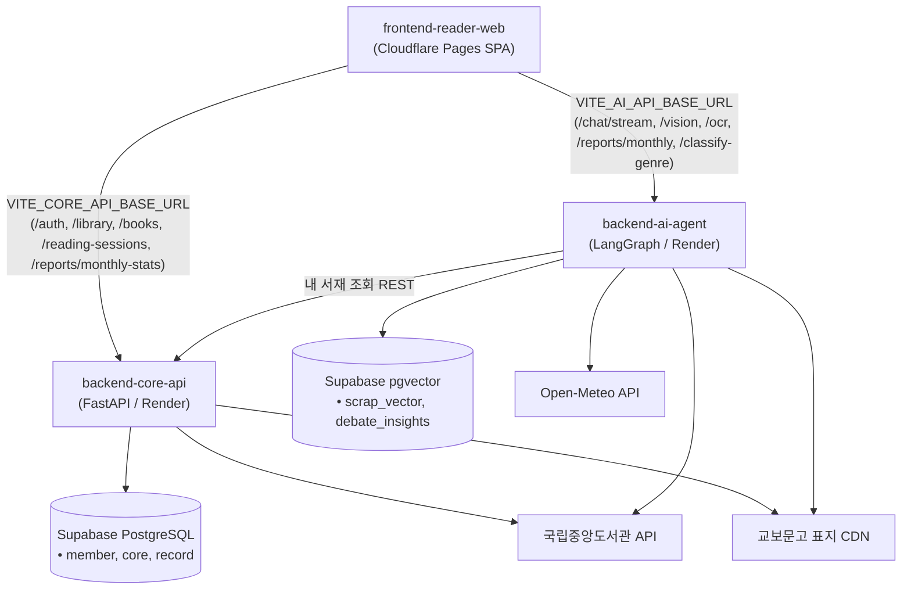

# frontend-reader-web 🐾📚

> **DPYB (Don't Paw-get Your Book) 인터랙티브 3D 가상 서재 & 독서 클라이언트 (Web SPA)**  
> Three.js(R3F) 기반 3D 가상 서재에 내 책을 꽂아두고, 4종 동물 사서와 실시간 대화하며 날씨·시간대·기분에 맞는 책을 추천받고, 4인 전문 파트너와 심층 독서 토론 및 집중 타이머/월간 리포트를 즐길 수 있는 지능형 웹 애플리케이션입니다.

---

## 🏛️ 아키텍처 개요

`frontend-reader-web`은 Cloudflare Pages에 정적 배포되는 React 19 SPA로서, 관심사 분리와 가용성을 위해 **DPYB 듀얼 백엔드 마이크로서비스 구조**(`backend-core-api`, `backend-ai-agent`)와 직접 연동됩니다.



---

## 💡 주요 기능 및 엔지니어링 특징

### 1. 📚 3D 인터랙티브 가상 서재 & 4종 사서 커서
- **Three.js & React Three Fiber (R3F)**: 등록한 도서의 판형/색상에 맞춰 3D 책장에 꽂히며, 책 클릭 시 확대 모션 및 상세 팝업(`BookDetail`) 렌더링.
- **사서별 3D 카메라 & 선반 캘리브레이션**: 블루(고양이 50권 상한 방어, 선반당 10권), 슈빌(황새), 누디(바다달팽이), 게코(도마뱀) 4종 사서별 독립 카메라 시점 및 선반 좌표 완벽 반영.
- **사서 맞춤 커서 & 손전등 다크 모드**: 마우스 추적 애니메이션 커서(클릭 모션, 6초 자동 소멸 말풍선), 사서별 고유 테마 컬러 및 다크 모드 시 커서 중심 조명(손전등 효과).

### 2. 💬 실시간 SSE 사서 챗봇 & 3단계 AI 독서 토론
- **SSE 실시간 스트리밍 대화 (`/api/v1/chat/stream`)**: 발바닥 순차 애니메이션(`LoadingSequence`) 후 첫 토큰 즉시 타이핑 렌더링(체감 대기 시간 단축).
- **실시간 날씨/무드 시그널 & 서재 빠른 탐색**: Open-Meteo 기반 실시간 기상/무드 뱃지 동적 표출, 내 서재 도서 빠른 자연어 검색 및 국립중앙도서관 실서지 검증 도서 원클릭 서재 등록.
- **3단계 AI 독서 토론 플로우**:
  - 1단계: 4인 전문 파트너 선택 (평론가·이야기꾼·상담사·관찰가)
  - 2단계: 최상단 '나만의 주제로 토론하기' 또는 '내 서재 도서' 선택
  - 3단계: 심층 대화 및 피날레 도서 큐레이션 서재 연계 (2턴 이상 미마무리 시 이탈 방지 확인창)

### 3. ⏱️ 독서 집중 타이머 & 월간 독서 리포트 시각화
- **독서 집중 타이머 (스톱워치/뽀모도로)**: 서재 FAB 또는 도서 상세에서 진입, 완독 도서 제외 필터링, 60초 미만 초 단위 시간(`duration_seconds`) 정밀 저장 및 도서 진도율 백엔드 동기화.
- **월간 독서 리포트 시각화 & PDF 내보내기 (`/reports`)**: Recharts 기반 주간 독서 흐름 곡선 그래프 & KDC 10대 장르 점유율 도넛 차트, 날씨별 베스트 도서 매칭 Grid 카드, 사서 맞춤형 원클릭 PDF 내보내기(`html2canvas` + `jspdf`).

### 4. 📷 정밀 도서 등록 & 인터랙티브 문장 수집 (OCR)
- **도서 등록 (웹캠 / 업로드 / ISBN)**: 웹캠 정지프레임 캡처 또는 이미지 업로드 후 Gemini Vision 바코드 스캔 및 Tesseract.js 클라이언트 OCR, ISBN 직접 입력 지원.
- **문장 수집 인터랙티브 크롭 모달 (`ImageCropModal`)**: 스마트폰 사진 촬영 후 드래그로 원하는 문장 영역만 지정(Crop)하여 백엔드로 전송함으로써 노이즈 제거 및 추출 정확도 극대화.

### 5. 🔐 안전한 인증 & 해커톤 게스트 체험 모드
- **메모리 기반 Access Token & HttpOnly 쿠키**: XSS 원천 차단을 위해 토큰을 로컬스토리지에 두지 않고 메모리에 보관하며, `authFetch` 인터셉터를 통해 401 시 무중단 자동 갱신(Silent Refresh) 수행.
- **Google & Kakao 소셜 로그인 및 게스트 모드**: [DPYB 체험하기] 버튼으로 로그인 없이 즉시 게스트 JWT를 발급받아 둘러볼 수 있으며 쓰기 작업 시 403 차단 및 안내 토스트 제공.

---

## 🛠️ 기술 스택

| 구분 | 사용 기술 |
|---|---|
| **프레임워크 & 빌더** | React 19, Vite 8 |
| **언어** | JavaScript (ES2022), TypeScript (점진적 적용) |
| **라우팅** | React Router 7 (`react-router-dom`) |
| **3D 그래픽** | Three.js, `@react-three/fiber`, `@react-three/drei` |
| **데이터 시각화** | Recharts (곡선 차트, 도넛 차트) |
| **PDF & 리포트 출력** | html2canvas, jspdf, Print Media Query CSS |
| **OCR (클라이언트)** | tesseract.js (브라우저 Web Worker 구동) |
| **도구 & 캘리브레이션** | leva (3D 카메라/선반 위치 조정 도구), ESLint 10, TypeScript |
| **상태 관리** | React Context + Provider (`AuthProvider`, `BooksProvider`, `LibrarianProvider`, `ThemeProvider`, `ToastProvider`) |
| **배포 & 호스팅** | Cloudflare Pages (정적 SPA 배포, `wrangler.jsonc`) |

---

## 📂 프로젝트 구조

```text
frontend-reader-web/
├── app/                          # 애플리케이션 소스 루트
│   ├── api/                      # 백엔드 API 클라이언트 계층
│   │   ├── apiBase.js            # 듀얼 백엔드 베이스 URL (core-api, ai-agent 분기)
│   │   ├── authApi.js            # 회원가입, 로그인, 게스트, JWT 쿠키 인프라 (authFetch)
│   │   ├── bookApi.js            # 서재 도서 CRUD, 책장, 독서 진도율
│   │   ├── chatApi.js            # 사서/토론 대화 SSE 스트리밍 (done, books, metadata)
│   │   ├── genreApi.js           # 장르 분류 연동
│   │   ├── geolocation.js        # 브라우저 좌표 ➔ WMO 날씨 코드 변환
│   │   ├── recordApi.js          # 독서 기록, 독서 세션, OCR 요청
│   │   └── reportApi.js          # 월간 독서 리포트 데이터 정규화 어댑터
│   ├── components/               # 공통 UI (Gnb, Toast, ImageCropModal, ProtectedRoute 등)
│   ├── data/                     # 정적 데이터 및 매퍼 (librarians, genres)
│   ├── features/                 # 도메인 피처 컴포넌트
│   │   ├── bookshelf3d/          # 3D 책 모델, 책등/표지 렌더링 (Book3D)
│   │   ├── register/             # 책 등록 및 표지 색상 추출 (ocrUtils)
│   │   └── room/                 # 3D 서재 씬, 사서 챗봇/토론, 도서 상세, 독서 타이머
│   ├── pages/                    # 라우트 단위 페이지
│   │   ├── MyLibrary.jsx         # 3D 가상 서재 메인 화면
│   │   ├── RegisterBook.jsx      # 책 등록 (웹캠/업로드/ISBN)
│   │   ├── MonthlyReport.jsx     # 월간 독서 리포트 시각화 & PDF
│   │   ├── LibrarianProfiles.jsx # 4종 사서 프로필 및 페르소나
│   │   ├── MyPage.jsx            # 내 정보, 프로필 사진 1:1 크롭, 비밀번호 변경
│   │   ├── LoginPage.jsx         # 로그인 & [DPYB 체험하기] 게스트 모드
│   │   ├── SignupPage.jsx        # 회원가입
│   │   └── PasswordReset.jsx     # 비밀번호 찾기/재설정
│   ├── store/                    # Context Provider 및 전역 스토어
│   └── styles/                   # 전역 테마 및 스타일
├── public/                       # 정적 자산 (보호 대상 일러스트, 폰트, 커서, 배경)
├── index.html                    # 엔트리 HTML
├── vite.config.js                # Vite 설정 및 개발 서버 듀얼 프록시
├── wrangler.jsonc                # Cloudflare Pages/Workers 정적 SPA 배포 설정
├── tsconfig.json                 # TypeScript 설정
└── README.md
```

---

## 📋 핵심 화면 및 라우팅 요약

| 경로 | 화면 | 인증 여부 | 설명 |
|---|---|---|---|
| `/login` | 로그인 | 불필요 | 자체 로그인, Google/Kakao 소셜 로그인, [DPYB 체험하기] 게스트 모드 |
| `/signup` | 회원가입 | 불필요 | 회원가입 및 이용약관 3종 동의 |
| `/password/forgot` | 비밀번호 재설정 | 불필요 | 이메일 기반 비밀번호 찾기 및 재설정 |
| `/library` | 내 서재 (3D) | **필요** | 3D 가상 서재 메인, 사서 챗봇, 독서 토론, 독서 타이머, 책 상세 |
| `/register` | 도서 등록 | **필요** | 웹캠/사진 업로드 OCR, ISBN 바코드 및 직접 입력 등록 |
| `/reports` | 월간 독서 리포트 | **필요** | 독서 리듬/장르 차트 시각화, AI 독서가 분석, 맞춤 PDF 다운로드 |
| `/librarians` | 사서 프로필 | **필요** | 4종 사서(블루/슈빌/누디/게코) MBTI, 독서 성향, 페르소나 소개 |
| `/mypage` | 마이페이지 | **필요** | 내 정보, 프로필 사진 1:1 크롭 수정, 비밀번호 변경, 계정 탈퇴 |

---

## 🚀 로컬 개발 및 실행 가이드

```bash
# 1. 의존성 설치
npm install

# 2. 환경변수 설정 (.env.example 복사)
cp .env.example .env

# 3. 로컬 개발 서버 구동 (HMR)
npm run dev

# 4. 커밋 전 3단 무결성 검증 (필수)
npm run typecheck   # TypeScript 컴파일 검사 (0 errors)
npm run lint        # ESLint 린트 검사 (0 errors)
npm run build       # Vite 프로덕션 번들 빌드 검증
```

---

## 🛡️ 라이선스 / 저작권

이 프로젝트에 사용된 **UI 일러스트, 버튼, 사서 캐릭터 및 커서 등 모든 시각 에셋**은 [Clia Lim](https://github.com/clialim)의 독점 창작물입니다.

> **© 2026 Clia Lim. All Rights Reserved.**

- **보호 대상**: `public/` 디렉터리 내의 모든 이미지 에셋(`room/`, `cursors/`, `profile/`, `button/`, 로고 등) 및 원본 디자인 소스
- 저작권자의 사전 서면 허락 없는 **무단 복제, 재배포, 2차 가공 및 상업적 이용을 엄격히 금지**합니다.
- 웹 클라이언트에는 우클릭 방지 및 CSS 드래그 방지 조치가 적용되어 있습니다.
- 소스 코드 라이선스는 시각 에셋과 별도로 팀 프로젝트 정책을 따릅니다.
