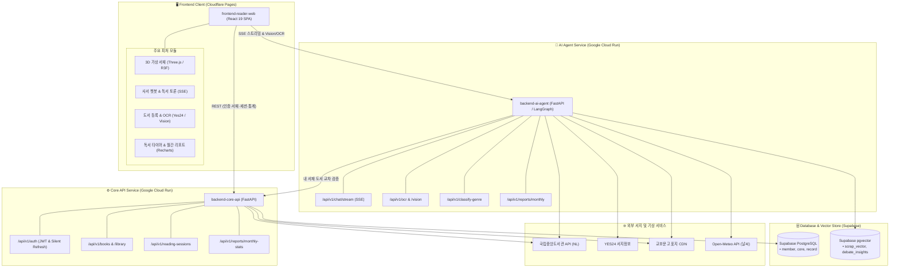
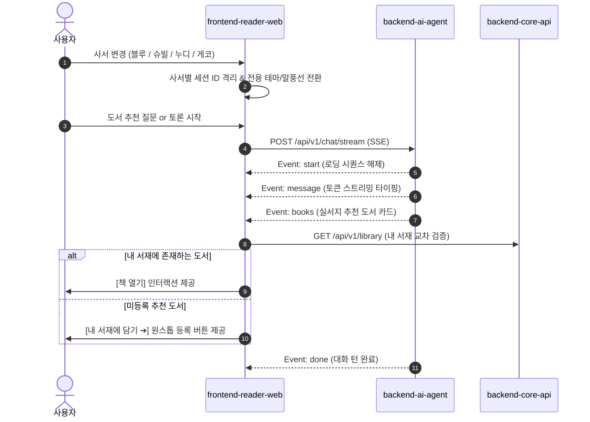
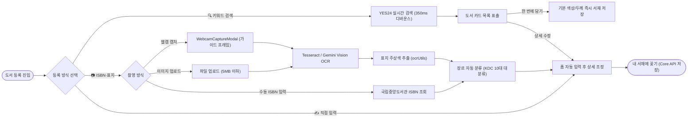

# frontend-reader-web 🐾📚

> **DPYB (Don't Paw-get Your Book) 인터랙티브 3D 가상 서재 & 독서 클라이언트 (Web SPA)**  
> Three.js(R3F) 기반 3D 가상 서재에 내 책을 꽂아두고, 4종 동물 사서와 실시간 대화하며 날씨·시간대·기분에 맞는 책을 추천받고, 4인 전문 파트너와 심층 독서 토론 및 집중 타이머/월간 리포트를 즐길 수 있는 지능형 웹 애플리케이션입니다.

---

## 🏛️ 아키텍처 개요

`frontend-reader-web`은 Cloudflare Pages에 정적 배포되는 React 19 SPA로서, 관심사 분리와 고가용성을 위해 **DPYB 듀얼 백엔드 마이크로서비스 구조**(`backend-core-api`, `backend-ai-agent`)와 직접 연동됩니다.


```mermaid
flowchart TB
    subgraph ClientLayer["🖥️ Frontend Client (Cloudflare Pages)"]
        SPA["frontend-reader-web (React 19 SPA)"]
        subgraph Features["주요 피처 모듈"]
            Lib3D["3D 가상 서재 (Three.js / R3F)"]
            ChatStream["사서 챗봇 & 독서 토론 (SSE)"]
            RegMod["도서 등록 & OCR (Yes24 / Vision)"]
            TimerRep["독서 타이머 & 월간 리포트 (Recharts)"]
        end
        SPA --- Features
    end

    subgraph CoreBackend["⚙️ Core API Service (Google Cloud Run)"]
        Core["backend-core-api (FastAPI)"]
        CoreAuth["/api/v1/auth (JWT & Silent Refresh)"]
        CoreBooks["/api/v1/books & /library"]
        CoreSessions["/api/v1/reading-sessions"]
        CoreStats["/api/v1/reports/monthly-stats"]
        Core --- CoreAuth & CoreBooks & CoreSessions & CoreStats
    end

    subgraph AIBackend["🤖 AI Agent Service (Google Cloud Run)"]
        Agent["backend-ai-agent (FastAPI / LangGraph)"]
        AgentChat["/api/v1/chat/stream (SSE)"]
        AgentOCR["/api/v1/ocr & /vision"]
        AgentGenre["/api/v1/classify-genre"]
        AgentReport["/api/v1/reports/monthly"]
        Agent --- AgentChat & AgentOCR & AgentGenre & AgentReport
    end

    subgraph DatabaseLayer["🗄️ Database & Vector Store (Supabase)"]
        SupaDB[("Supabase PostgreSQL<br/>• member, core, record")]
        SupaVec[("Supabase pgvector<br/>• scrap_vector, debate_insights")]
    end

    subgraph ExternalAPIs["🌐 외부 서지 및 기상 서비스"]
        NL["국립중앙도서관 API (NL)"]
        Yes24["YES24 서지정보"]
        Kyobo["교보문고 표지 CDN"]
        Meteo["Open-Meteo API (날씨)"]
    end

    SPA -- "REST (인증·서재·세션·통계)" --> Core
    SPA -- "SSE 스트리밍 & Vision/OCR" --> Agent

    Core --> SupaDB
    Core --> NL
    Core --> Kyobo

    Agent --> SupaVec
    Agent --> NL
    Agent --> Yes24
    Agent --> Meteo
    Agent --> Kyobo
    Agent -- "내 서재 도서 교차 검증" --> Core
```

---

## 🔄 핵심 서비스 흐름 (Workflows)

### 1. 실시간 사서 대화 & 3단계 독서 토론 플로우

```mermaid
sequenceDiagram
    autonumber
    actor User as 사용자
    participant App as frontend-reader-web
    participant AI as backend-ai-agent
    participant Core as backend-core-api

    User->>App: 사서 변경 (블루 / 슈빌 / 누디 / 게코)
    App->>App: 사서별 세션 ID 격리 & 전용 테마/말풍선 전환
    User->>App: 도서 추천 질문 or 토론 시작
    App->>AI: POST /api/v1/chat/stream (SSE)
    AI-->>App: Event: start (로딩 시퀀스 해제)
    AI-->>App: Event: message (토큰 스트리밍 타이핑)
    AI-->>App: Event: books (실서지 추천 도서 카드)
    App->>Core: GET /api/v1/library (내 서재 교차 검증)
    alt 내 서재에 존재하는 도서
        App->>User: [책 열기] 인터랙션 제공
    else 미등록 추천 도서
        App->>User: [내 서재에 담기 ➔] 원스톱 등록 버튼 제공
    end
    AI-->>App: Event: done (대화 턴 완료)
```

### 2. 멀티모달 도서 등록 & OCR 처리 흐름

```mermaid
flowchart LR
    Start([도서 등록 진입]) --> TabChoice{등록 방식 선택}

    TabChoice -- "🔍 키워드 검색" --> Search["YES24 실시간 검색 (350ms 디바운스)"]
    Search --> SearchResult["도서 카드 목록 표출"]
    SearchResult -- "한 번에 담기" --> InstantReg["기본 색상/두께 즉시 서재 저장"]
    SearchResult -- "상세 수정" --> FormPrefill["폼 자동 입력 후 상세 조정"]

    TabChoice -- "📷 ISBN·표지" --> ScanMethod{촬영 방식}
    ScanMethod -- "웹캠 캡처" --> Webcam["WebcamCaptureModal (가이드 프레임)"]
    ScanMethod -- "이미지 업로드" --> Upload["파일 업로드 (5MB 이하)"]
    ScanMethod -- "수동 ISBN 입력" --> ManualIsbn["국립중앙도서관 ISBN 조회"]

    Webcam & Upload --> OCR["Tesseract / Gemini Vision OCR"]
    OCR --> ColorExtract["표지 주상색 추출 (ocrUtils)"]
    ColorExtract --> GenreClassify["장르 자동 분류 (KDC 10대 대분류)"]
    ManualIsbn --> GenreClassify

    GenreClassify --> FormPrefill
    TabChoice -- "✍️ 직접 입력" --> FormPrefill
    FormPrefill --> Submit(["내 서재에 꽂기 (Core API 저장)"])
```

---

## 💡 주요 기능 및 엔지니어링 특징

### 1. 📚 3D 인터랙티브 가상 서재 & 4종 사서 시야각 캘리브레이션
- **Three.js & React Three Fiber (R3F)**: 등록한 도서의 판형/두께/색상에 맞춰 3D 책장에 꽂히며, 책 클릭 시 3D 확대 모션 및 상세 팝업(`BookDetail`) 렌더링.
- **사서별 3D 카메라 & 선반 캘리브레이션**:
  - 블루(고양이): 50권 상한(선반당 10권), 고유 카메라 시야각.
  - 슈빌(황새), 누디(바다달팽이), 게코(도마뱀): 표준 FOV 28도(`[-9.38, -0.89, 24]`, target `[7.52, -0.13, 0.67]`)로 보정되어 1~7번 전체 선반의 도서 가시성 100% 보장.
- **사서 맞춤 커서 & 손전등 다크 모드**: 마우스 추적 애니메이션 커서(클릭 모션, 6초 자동 소멸 말풍선), 사서별 고유 테마 컬러 및 다크 모드 시 커서 중심 조명(손전등 효과).
- **모바일 5개 선반 터치 & 바텀시트 (`MobileShelfSheet`)**: 768px 이하 모바일 환경에서 1~5번 선반을 터치하여 선반별 도서 리스트를 상하 수직 스크롤로 열람.

### 2. 💬 실시간 SSE 사서 챗봇 & 3단계 AI 독서 토론
- **SSE 실시간 스트리밍 대화 (`/api/v1/chat/stream`)**: 발바닥 순차 애니메이션(`LoadingSequence`) 후 첫 토큰 즉시 타이핑 렌더링(체감 대기 시간 단축).
- **사서별 대화 세션 및 발신자 격리**: 사서 전환 시 화면 말풍선 즉시 독립 교체, 사서별 sessionId 격리로 LLM 페르소나 오염 방지.
- **3단계 AI 독서 토론 플로우**:
  - 1단계: 4인 전문 파트너 선택 (평론가·이야기꾼·상담사·관찰가)
  - 2단계: 최상단 '나만의 주제로 토론하기' 또는 '내 서재 도서' 선택
  - 3단계: 심층 대화 및 피날레 도서 큐레이션 서재 연계 (2턴 이상 미마무리 시 이탈 방지 확인창)

### 3. ⏱️ 독서 집중 타이머 & 월간 독서 리포트 시각화
- **독서 집중 타이머 (스톱워치/뽀모도로)**: 서재 FAB 또는 도서 상세에서 진입, 완독 도서 제외 필터링, 60초 미만 초 단위 시간(`duration_seconds`) 정밀 저장 및 도서 진도율 백엔드 동기화.
- **월간 독서 리포트 시각화 & PDF 내보내기 (`/reports`)**: Recharts 기반 주간 독서 흐름 곡선 그래프 & KDC 10대 장르 점유율 도넛 차트, 날씨별 베스트 도서 매칭 Grid 카드, 사서 맞춤형 원클릭 PDF 내보내기(`html2canvas` + `jspdf`).
- **정직한 Empty State & 게스트 모드 안내**: 활동 유무(`hasActivity`) 판별 기반 스켈레톤/안내 배너 노출.

### 4. 📷 모듈화된 도서 등록 & 인터랙티브 문장 수집
- **서브 컴포넌트 모듈화 (`app/features/register/`)**:
  - `BookSearchSection`: YES24 검색 및 결과 카드 그리드
  - `BookIsbnScanSection`: 카메라/업로드 및 OCR/수동 ISBN 검색
  - `BookRegisterForm`: 메타데이터 폼 및 사서별 색상 팔레트
  - `RecommendationBanner`: AI 사서 추천 도서 자동 채움 안내
  - `IsbnGuideModal`: ISBN 촬영 가이드 포탈 모달
- **문장 수집 인터랙티브 크롭 모달 (`ImageCropModal`)**: 스마트폰 사진 촬영 후 드래그로 원하는 문장 영역만 지정(Crop)하여 백엔드로 전송함으로써 노이즈 제거 및 추출 정확도 극대화.

### 5. 🔐 안전한 인증 & 해커톤 게스트 체험 모드
- **메모리 기반 Access Token & HttpOnly 쿠키**: XSS 원천 차단을 위해 토큰을 로컬스토리지에 두지 않고 메모리에 보관하며, `authFetch` 인터셉터를 통해 401 시 무중단 자동 갱신(Silent Refresh) 수행.
- **Google & Kakao 소셜 로그인 및 게스트 모드**: [DPYB 체험하기] 버튼으로 로그인 없이 즉시 게스트 JWT를 발급받아 둘러볼 수 있으며 쓰기 작업 시 403 차단 및 안내 토스트 제공.

---

## 🛠️ 기술 스택

| 구분 | 사용 기술 |
|---|---|
| **프레임워크 & 빌더** | React 19, Vite 8 |
| **언어** | JavaScript (ES2022), TypeScript (점진적 적용) |
| **라우팅** | React Router 7 (`react-router-dom`) |
| **3D 그래픽** | Three.js, `@react-three/fiber`, `@react-three/drei` |
| **데이터 시각화** | Recharts (곡선 차트, 도넛 차트) |
| **PDF & 리포트 출력** | html2canvas, jspdf, Print Media Query CSS |
| **OCR (클라이언트)** | tesseract.js (브라우저 Web Worker 구동) |
| **도구 & 캘리브레이션** | leva (3D 카메라/선반 위치 조정 도구), ESLint 10, TypeScript |
| **상태 관리** | React Context + Provider (`AuthProvider`, `BooksProvider`, `LibrarianProvider`, `ThemeProvider`, `ToastProvider`) |
| **배포 & 호스팅** | Cloudflare Pages (정적 SPA 배포, `wrangler.jsonc`) |

---

## 📂 프로젝트 구조

```text
frontend-reader-web/
├── app/                          # 애플리케이션 소스 루트
│   ├── api/                      # 백엔드 API 클라이언트 계층
│   │   ├── apiBase.js            # 듀얼 백엔드 베이스 URL (core-api, ai-agent 분기)
│   │   ├── authApi.js            # 회원가입, 로그인, 게스트, JWT 쿠키 인프라 (authFetch)
│   │   ├── bookApi.js            # 서재 도서 CRUD, 책장, 독서 진도율
│   │   ├── chatApi.js            # 사서/토론 대화 SSE 스트리밍 (done, books, metadata)
│   │   ├── genreApi.js           # 장르 분류 연동
│   │   ├── geolocation.js        # 브라우저 좌표 ➔ WMO 날씨 코드 변환
│   │   ├── recordApi.js          # 독서 기록, 독서 세션, OCR 요청
│   │   └── reportApi.js          # 월간 독서 리포트 데이터 정규화 어댑터
│   ├── components/               # 공통 UI (Gnb, Toast, ImageCropModal, ProtectedRoute 등)
│   ├── data/                     # 정적 데이터 및 매퍼 (librarians, genres)
│   ├── features/                 # 도메인 피처 컴포넌트
│   │   ├── bookshelf3d/          # 3D 책 모델, 책등/표지 렌더링 (Book3D)
│   │   ├── register/             # 도서 등록 서브 모듈 (Search, Scan, Form, Banner, Modal, ocrUtils)
│   │   └── room/                 # 3D 서재 씬, 사서 챗봇/토론, 도서 상세, 독서 타이머
│   ├── pages/                    # 라우트 단위 페이지
│   │   ├── MyLibrary.jsx         # 3D 가상 서재 메인 화면
│   │   ├── RegisterBook.jsx      # 책 등록 화면 (서브 컴포넌트 합성)
│   │   ├── MonthlyReport.jsx     # 월간 독서 리포트 시각화 & PDF
│   │   ├── LibrarianProfiles.jsx # 4종 사서 프로필 및 페르소나
│   │   ├── MyPage.jsx            # 내 정보, 비밀번호 변경
│   │   ├── LoginPage.jsx         # 로그인 & [DPYB 체험하기] 게스트 모드
│   │   ├── SignupPage.jsx        # 회원가입
│   │   ├── TermsModal.jsx        # 이용약관 모달
│   │   └── PasswordReset.jsx     # 비밀번호 찾기/재설정
│   ├── store/                    # Context Provider 및 전역 스토어
│   └── styles/                   # 전역 테마 및 스타일
├── .harness/                     # DPYB 바이브 코딩 하네스 규격 문서
│   ├── HANDOFF.md                # 최근 세션 로그
│   ├── PLAN.md                   # 미완료 계획
│   ├── STATE.md                  # 완료 스냅샷
│   ├── DECISIONS.md              # 아키텍처 결정 로그
│   └── archive/                  # 롤링 아카이브
├── public/                       # 정적 자산 (보호 대상 일러스트, 폰트, 커서, 배경)
├── index.html                    # 엔트리 HTML
├── vite.config.js                # Vite 설정 및 개발 서버 듀얼 프록시
├── wrangler.jsonc                # Cloudflare Pages/Workers 정적 SPA 배포 설정
├── tsconfig.json                 # TypeScript 설정
└── README.md
```

---

## 📋 핵심 화면 및 라우팅 요약

| 경로 | 화면 | 인증 여부 | 설명 |
|---|---|---|---|
| `/login` | 로그인 | 불필요 | 자체 로그인, Google/Kakao 소셜 로그인, [DPYB 체험하기] 게스트 모드 |
| `/signup` | 회원가입 | 불필요 | 회원가입 및 이용약관 3종 동의 |
| `/password/forgot` | 비밀번호 재설정 | 불필요 | 이메일 기반 비밀번호 찾기 및 재설정 |
| `/library` | 내 서재 (3D) | **필요** | 3D 가상 서재 메인, 사서 챗봇, 독서 토론, 독서 타이머, 책 상세 |
| `/register` | 도서 등록 | **필요** | YES24 검색, 웹캠/사진 업로드 OCR, ISBN 바코드 및 직접 입력 등록 |
| `/reports` | 월간 독서 리포트 | **필요** | 독서 리듬/장르 차트 시각화, AI 독서가 분석, 맞춤 PDF 다운로드 |
| `/librarians` | 사서 프로필 | **필요** | 4종 사서(블루/슈빌/누디/게코) MBTI, 독서 성향, 페르소나 소개 |
| `/mypage` | 마이페이지 | **필요** | 내 정보, 비밀번호 변경, 계정 탈퇴 |

---

## 📱 디스플레이 규격 및 반응형 UI/UX 가이드

DPYB 웹 클라이언트는 **Desktop/Laptop (마우스/키보드 환경)**과 **Mobile & Tablet (스마트폰 ~ 12.9" 대형 태블릿 터치 통합 환경)**으로 이원화된 최적의 반응형 UX를 지원합니다.

- 📖 **상세 가이드 문서**: [`docs/UI_RESPONSIVE_GUIDELINE.md`](docs/UI_RESPONSIVE_GUIDELINE.md)
- **주요 특징**:
  - **Mobile & Tablet (Touch Device)**: 상단 선반 셀렉터 + `MobileShelfSheet` 바텀시트, 드래그형 `MobileChatFAB` 사서 플로팅 버튼 & 미니 액션, 1열 수직 스크롤 폼 & Safe Area 지원
  - **Desktop / Laptop (Mouse & Keyboard)**: Three.js 3D 서재 직접 마우스 호버/선택, 마우스 추적 동물 사서 커서(`LibrarianCursor`) & 조명 효과, 다열(Multi-column) 와이드 모달 레이아웃

---

## 🚀 로컬 개발 및 실행 가이드

```bash
# 1. 의존성 설치
npm install

# 2. 환경변수 설정 (.env.example 복사)
cp .env.example .env

# 3. 로컬 개발 서버 구동 (HMR)
npm run dev

# 4. 커밋 전 계층형 무결성 검증 (Tier 1 & Tier 2)
npm run check:harness # 하네스 규격 검증 (HANDOFF, PLAN, STATE, archive)
npm run lint          # ESLint 린트 검사 (0 errors)
npm run typecheck     # TypeScript 컴파일 검사 (0 errors)
npm run build         # Vite 프로덕션 번들 빌드 검증
```

---

## 🛡️ 라이선스 / 저작권

이 프로젝트에 사용된 **UI 일러스트, 버튼, 사서 캐릭터 및 커서 등 모든 시각 에셋**은 [Clia Lim](https://github.com/clialim)의 독점 창작물입니다.

> **© 2026 Clia Lim. All Rights Reserved.**

- **보호 대상**: `public/` 디렉터리 내의 모든 이미지 에셋(`room/`, `cursors/`, `profile/`, `button/`, 로고 등) 및 원본 디자인 소스
- 저작권자의 사전 서면 허락 없는 **무단 복제, 재배포, 2차 가공 및 상업적 이용을 엄격히 금지**합니다.
- 웹 클라이언트에는 우클릭 방지 및 CSS 드래그 방지 조치가 적용되어 있습니다.
- 소스 코드 라이선스는 시각 에셋과 별도로 팀 프로젝트 정책을 따릅니다.
